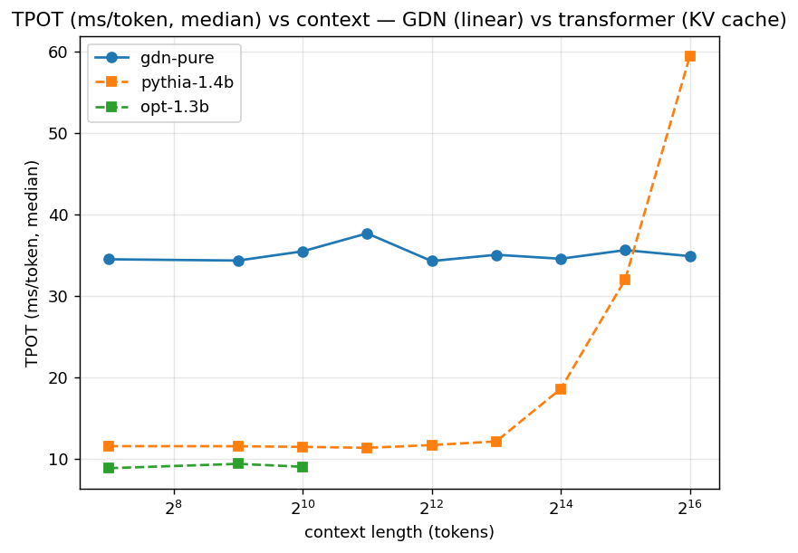
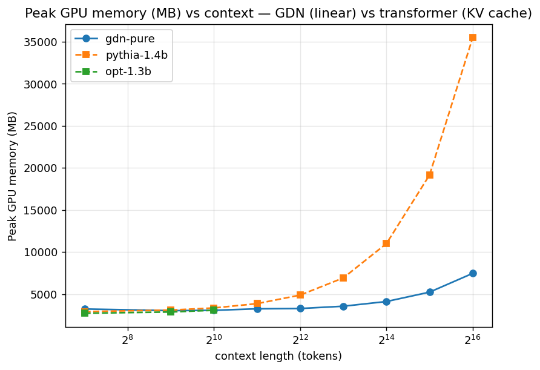

# Decode Premise: GDN vs a Standard Transformer (GPU measurement)

This document validates the premise behind the decode-only architecture in
[decode_disaggregated_gemv.md](decode_disaggregated_gemv.md): GatedDeltaNet decode (linear
attention → O(1) compute/token, constant-size recurrent state) is
fundamentally better-scaling than a standard transformer (full attention →
O(n)/token, KV cache that grows with context).

It is a **PyTorch/GPU** measurement of the *architectural premise*, not the
FPGA's TPOT. The trustworthy signal is the **slope vs context** (flat vs
growing), not the absolute per-token number — see "Why GDN looks slow on GPU"
below for why the GPU understates GDN and why that argues *for* the FPGA.

**Two updates to how this document should be read (2026-08-31).**

1. **The accelerator now beats the stock-GPU number outright.** Iter66e
   measures **26.654 ms/token** on card against the ~35 ms stock reference
   here — 24% faster. That was not true when this document was written.
2. **Do not lean on that margin as the headline claim.** A side experiment on
   branch `worktree-gpu-decode-opt` showed the 35 ms is dominated by dispatch,
   not arithmetic — 1,981 kernel launches per token, 58% of wall time in gaps,
   4.1% of peak bandwidth — and capturing the per-token step as a single CUDA
   graph reached **4.20 ms/token**, verified token-identical to eager. A
   hand-optimised GPU therefore goes far below anything this accelerator
   currently reaches. The durable claims remain the ones this document is
   actually about: **flat O(1) latency, constant memory with no KV cache, and
   performance per watt and per dollar** — not raw speed.

Harness: [`scripts/bench_tpot.py`](../../scripts/bench_tpot.py). Raw data:
[`report/tpot/`](../../report/tpot/) (`tpot_results.{json,csv}`, two PNGs).

## Setup

| | |
|---|---|
| Device | NVIDIA A100 80GB PCIe |
| Precision | bf16 |
| Batch | 1 (single-stream — the latency regime the FPGA targets) |
| Timing | `torch.cuda.Event`, 8-step warmup discarded, median of 64 decode steps |
| Decode mode | transformers: KV cache via SDPA (`use_cache=True`); GDN: fla `fused_recurrent` (O(1) recurrent + conv state) |

**Models — matched ~1.3B backbone (hidden 2048 / 24 layers); only the token
mixer differs:**

| key | HF id | params | token mixing |
|-----|-------|-------:|--------------|
| `gdn-pure` | `m-a-p/1.3B-100B-GatedDeltaNet-pure` | 1.466 B | gated delta rule — linear, O(1) state |
| `pythia-1.4b` | `EleutherAI/pythia-1.4b` | 1.415 B | full MHA + RoPE — KV cache, O(n) |
| `opt-1.3b` | `facebook/opt-1.3b` | 1.316 B | full MHA + learned pos — KV cache, O(n) |

The GDN model is loaded via the fla `GatedDeltaNetForCausalLM` class (its
`model_type: gated_deltanet` is registered with AutoModel at import). Note: this
repo's `lit_gpt/gated_delta_net.py` is chunk-only (`raise NotImplementedError`
for `fused_recurrent` decode) — decode must use the HF fla model, not lit_gpt.

## Results

### TPOT — median ms/token (and tok/s)

| context | gdn-pure | pythia-1.4b | opt-1.3b |
|--------:|---------:|------------:|---------:|
| 128   | 34.5 (29) | 11.6 (86) | 8.9 (113) |
| 512   | 34.4 (29) | 11.6 (86) | 9.4 (106) |
| 1024  | 35.5 (28) | 11.5 (87) | 9.0 (111) |
| 2048  | 37.7 (27) | 11.4 (88) | — (cap)   |
| 4096  | 34.3 (29) | 11.7 (85) | — |
| 8192  | 35.1 (29) | 12.2 (82) | — |
| 16384 | 34.6 (29) | 18.6 (54) | — |
| 32768 | 35.6 (28) | 32.0 (31) | — |
| 65536 | **34.9 (29)** | **59.4 (17)** | — |

GDN is **flat at ~34–38 ms across a 512× context range**. The transformer is
flat (~11.5 ms) until ~8k, then climbs as the KV cache grows.

### Peak GPU memory (MB)

| context | gdn-pure | pythia-1.4b | opt-1.3b |
|--------:|---------:|------------:|---------:|
| 128   | 3222 | 2912 | 2716 |
| 2048  | 3245 | 3858 | 3069 |
| 8192  | 3553 | 6917 | — |
| 16384 | 4111 | 10996 | — |
| 32768 | 5227 | 19154 | — |
| 65536 | **7458** | **35470** | — |

GDN memory is ~constant (the slow rise is just the prompt residual stream, not a
cache). The transformer KV cache grows linearly and unbounded.




## The two crossovers

- **Latency crossover ≈ 32–40k tokens.** Below it the transformer is *faster*
  in absolute TPOT (its fused attention is mature; GDN pays GPU launch
  overhead). They equalize near 32k (Pythia 32.0 ms vs GDN 35.6 ms); by 64k GDN
  is **1.70× faster** (34.9 vs 59.4 ms) and the gap widens beyond.
- **Memory crossover is early and decisive.** GDN is leaner from ~2k up; at 64k
  it uses **4.7× less** memory (7.5 vs 35.5 GB), and the transformer keeps
  growing while GDN stays flat. This is the more immediate, more robust win.

OPT is the "classic 1.3B full-MHA" reference but its learned positional
embeddings hard-cap context at 2048 (decoding past it asserts), so it only
contributes the short-context points (fastest there, ~9 ms).

## Why GDN looks slow on GPU — and why that argues for the FPGA

GDN's TPOT (~35 ms ≈ 29 tok/s) is ~3× *worse* than the transformers (85–115
tok/s) at short context. Crucially this number is **flat across all context
lengths**, which proves the recurrence compute is trivial — the cost is **kernel
launch / low utilization overhead**, not arithmetic. At 1.3B / batch-1 the A100
sits mostly idle while fla fires many small Triton kernels sequentially across
24 layers per token.

This is exactly the overhead a custom FPGA dataflow removes: no per-layer kernel
launches, the recurrence runs flat-out, and there is no growing KV-cache
bandwidth. So the regime where GDN is architecturally best — single-stream,
low-latency, memory-bound decode — is precisely where the GPU is worst and a
custom accelerator is best. The GPU result therefore **understates** GDN's
decode advantage and confirms the decode-only accelerator thesis:
*decode is the FPGA-favorable regime.* The flat O(1) latency and constant memory
are real and measured.

## Methodology / fairness notes

- Both models run in their *proper* incremental decode mode (transformer KV
  cache; GDN recurrent + conv state), so neither is handicapped.
- Same matched backbone (hidden 2048 / 24 layers) — the only variable is the
  token mixer. (Minor: vocab differs, 32k GDN vs ~50k baselines; affects
  embedding/lm_head cost slightly, not the attention scaling.)
- bf16 on GPU; the FPGA is fp32 today — the **scaling shape transfers**, the
  absolute numbers do not.
- Pythia (RoPE) is run past its 2048 training length for the latency sweep;
  output quality is irrelevant to a timing measurement.
- batch=1: GDN would gain substantially from batching on a GPU (amortizing
  launches), but single-stream TPOT is the FPGA-relevant metric.

## Not benched: hybrid GDN

`m-a-p/1.3B-100B-GatedDeltaNet-hybrid-3-1` (mixes attention layers into the GDN
stack) was excluded: fla 0.4.2's `Attention.__init__` hard-requires flash-attn
(no SDPA/eager fallback), there is no `nvcc` on the host to build it, and torch's
`cxx11_abi=True` needs a precisely-matched prebuilt wheel
(torch2.7 / cu126 / cp311 / abiTRUE). The pure model has no attention layers so
it loads cleanly. The hybrid would partially *un-flatten* the decode curve as its
attention layers regrow a KV cache — a useful "cost of mixing in attention"
datapoint if the wheel is installed later.

## Reproduce

```bash
.micromamba/envs/gdn-hf/bin/python scripts/bench_tpot.py \
    --models gdn-pure pythia-1.4b opt-1.3b \
    --context-lengths 128 512 1024 2048 4096 8192 16384 32768 65536 \
    --decode-steps 64 --warmup 8 --out-dir report/tpot
# --quick for a smoke run; --models <subset> to pick models
```

## Implications for the Decode Accelerator

The premise is validated: GDN decode is flat O(1) in both latency and memory
while a standard transformer is O(n) in both. The work in
[decode_disaggregated_gemv.md](decode_disaggregated_gemv.md) uses a GEMV
datapath and multi-channel weight readers to address the one cost GDN
*does* pay per token: reading every weight once. That is bandwidth-bound and
constant per token (no KV cache), so the FPGA's job is to drive weight bandwidth
toward HBM's ceiling and turn GDN's architectural O(1) into a low absolute
ms/token that the GPU launch overhead masks here.
